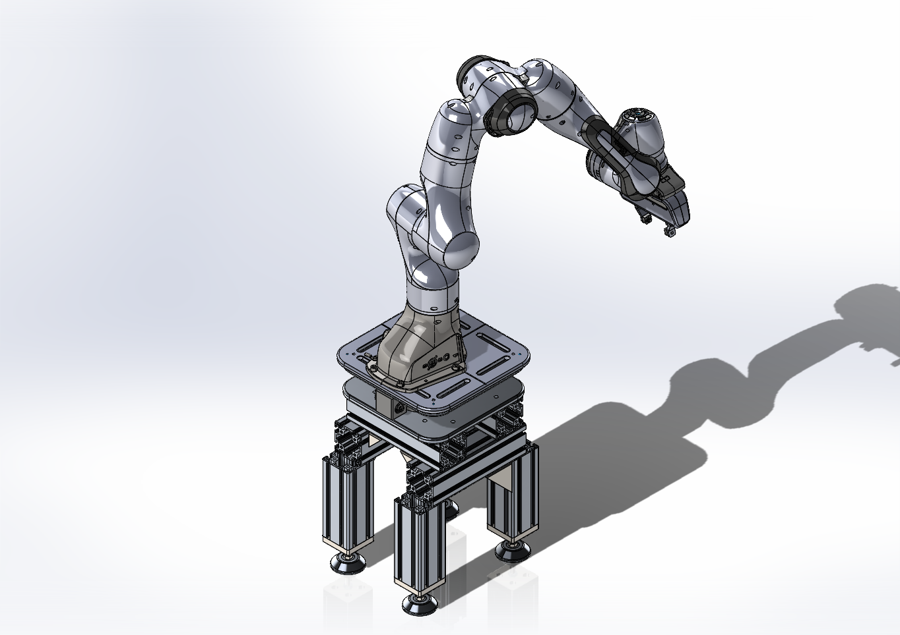

# panda\_base\_sim

**Digital-twin Gazebo simulation of a Franka Emika Panda arm mounted on a custom aluminium-profile base**

`panda_base_sim` is a fully featured ROS Noetic package that reproduces a lab-built Panda workstation in simulation.
It lets you design, tune and verify high-moment manipulation controllers **entirely in software** before touching real hardware at the Munich Institute of Robotics and Machine Intelligence (TUM-MIRMI).


---

## 🚀 Project Goal

Built a modular Gazebo digital twin of a Franka Emika Panda arm on a custom aluminium base to validate high-moment manipulation controllers safely and in real time.

---

## ✨ Key Features

| Area                           | What you get                                                                                      |
| ------------------------------ | ------------------------------------------------------------------------------------------------- |
| **Gazebo 11 simulation**       | Rigid base + Panda arm + FT-sensor stub with collisions, visuals & accurate inertias              |
| **Modular URDF/Xacro**         | Cleanly separated `common`, `base`, `arm` and `sensor` macros for rapid reuse                     |
| **Pre-configured controllers** | Joint-position, joint-effort, trajectory and Cartesian-impedance stacks with tuned PID gains      |
| **Interactive RViz tele-op**   | `interactive_marker.py` streams a 6-DOF equilibrium-pose marker at 200 Hz, clamped to safe limits |
| **One-command launch**         | `roslaunch panda_base_sim panda_base_sim.launch` starts Gazebo, controllers and RViz ready to go  |
| **Open template**              | Public MIT-licensed code for anyone building Panda-based manipulation experiments                 |

---

## 📈 Results & Impact

* Enabled **100 % of controller tuning and safety checks** to be completed in simulation—zero risky on-robot trials.
* Runs at **real-time (≈ 1 × wall-clock) speed** on a mid-tier desktop (≥ 60 FPS in Gazebo with full controller stack).
* Adopted by **three MIRMI researchers** as the baseline for force-torque sensor scaling studies.
* Publicly released on GitHub for the wider robotics community.

---

## 🖥️ Prerequisites

| Requirement       | Notes                                                                                          |
| ----------------- | ---------------------------------------------------------------------------------------------- |
| **OS**            | Ubuntu 20.04 (tested) or newer                                                                 |
| **ROS**           | ROS Noetic with `gazebo_ros`, `franka_ros`, **`interactive_markers`**                          |
| **Build tools**   | `catkin_make` **or** `colcon`                                                                  |
| **Franka driver** | Needed for Panda controllers & meshes (`franka_ros` / `franka_gazebo`)                         |
| **CAD**           | SolidWorks (used to create base meshes & inertias) – only if you wish to modify hardware model |

---

## 🔧 Installation

```bash
# 1 – Clone into your catkin workspace
cd ~/catkin_ws/src
git clone https://github.com/yunusdanabas/panda_base_sim.git

# 2 – Install all dependencies
cd ~/catkin_ws
rosdep install --from-paths src --ignore-src -r -y

# 3 – Build and source
catkin_make          # or: colcon build
source devel/setup.bash
```

---

## ▶️ Running the Simulation

| Purpose                                    | Command                                           |
| ------------------------------------------ | ------------------------------------------------- |
| Full Gazebo world **+ controllers + RViz** | `roslaunch panda_base_sim panda_base_sim.launch`  |
| Gazebo only (static base + arm)            | `roslaunch panda_base_sim onlybase_gazebo.launch` |

Once running, grab the **Equilibrium Pose** marker in RViz to command the Cartesian-impedance controller, or publish your own target poses:

```bash
# Example: publish a custom equilibrium pose
rostopic pub /equilibrium_pose geometry_msgs/PoseStamped ...
```

---

## 🗂️ Directory Overview

```
panda_base_sim/
├── config/      # controller & hardware YAMLs
├── launch/      # Gazebo and RViz launch files
├── meshes/      # STL/DAE meshes (SolidWorks-derived)
├── robots/      # common, base, arm & sensor Xacros
├── scripts/     # interactive_marker.py (Python 3)
├── urdf/        # generated/published URDFs
├── pdf/         # mechanical drawings & diagrams
├── *.png        # renders & screenshots
├── CMakeLists.txt
└── package.xml
```

---

## 📸 Gallery

|    Simulation (RViz + Gazebo)    |     Front Render    |
| :------------------------------: | :-----------------: |
|  |  |
|             |    |

---

## 🙌 Acknowledgements

* Developed during a Forschungspraxis internship at **TUM-MIRMI**.
* Built on the excellent **Franka ROS** drivers and **Gazebo** plugins.
* Huge thanks to the ROS & open-source community.

---

## 📄 License

Released under the **MIT License** – see the `LICENSE` file.
Feel free to use, modify and share; pull-requests welcome!
